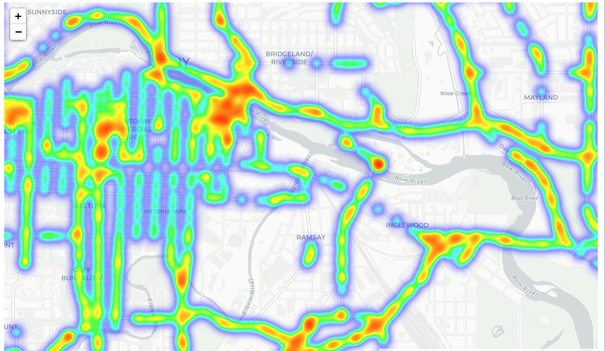

# Calgary-Traffic-App

## Introduction

This is one of my first projects created as a part of my Masters degree. The goal of this project was to learn the following:
- Make a GUI in Python to display data
- Use MongoDB to store data
- Use Jupyter Notebook to analyze data

To accomplish this I used Traffic and Incident data available from the City of Calgary and divided the project into 2 phases, an App and a Notebook. The App phase involved reading the data provided by the city and uploading it to a MongoDB cluster followed by displaying, sorting, analyzing, and mapping this data in the app. The Notebook phase involved analysis of the Traffic and Incident data as well as weather and road conditions to look for patterns.

## Requirements
Python Packages:
- pymongo
- tk-tools
- pandas
- folium
- pandastable
- matplotlib
- seaborn
- csv
- numpy
- math
- json

## Phase 1 - App

### How to Use

#### Startup

To run the app, simply execute the project_main.py file. This will start the reading of the data and uploading it to MongoDB. After the data is loaded the app will start and will display the following:

The user may now select which type of data they'd like to see and the year, and then click on one of the below functions.

#### Read

Clicking 'Read' will display the data as gathered from the city in cells:

#### Sort

Clicking 'Sort' will display data as gathered from the city in cells, sorted by most traffic volume or by most incidents at the location, based on the data type selected:

#### Analysis

Clicking analysis will display a chart showing the levels of traffic or incidents at the highest volume/incident location over the three years of data gathered:

#### Map

Clicking map will create a map.html file within the Phase 1 - App folder, which can be opened to display the location with the highest traffic volume or number of  incidents on a map of Calgary:

## Phase 2 - Notebook

This section will go over the logic and analysis of each section of the Notebook.

### Import Packages

Cell in this section imports almost all necessary packages, which follow:
Math, numpy, pandas, matplotlib, seaborn, folium, json.

### Opening Files, Converting to DataFrames

Cell in this section imports data from all .csv files in the package, including those in MonthlyWeather folder and then adds data to data frames. If there are errors raised by this cell, ensure that the file paths are correct.

### Cleaning Data

Cells in this section clean the data frames and make them more readable for future analysis.
- City Boundaries: Cell converts boundaries into 4 variables.
- Cameras: Cell adds new column to data frame for coordinates.
- Signals: Cell adds new column to data frame for coordinates.
- Signs: Cell adds new column to data frame for coordinates.
- Incidents: Cell adds new columns for coordinates, day, and month.
- Weather: Cell merges daily weather data (average daily temperature calculated here) with incident dataframe.
- Speed Limits: Cell adds new columns for coordinates, updates distance column.
- Traffic Volume: Cell adds new column for coordinates.

### Creating Map and Grid

Cells in this section are used to create a folium map of Calgary broken down into 10x10 grids, where the traffic/road data in each section is presented through a popup when grid section is clicked.

#### Grid Methods:

- create_grid: method creates grid segments which can then be used to interpret data and be laid over a map

#### Value Methods:

- get_single_count: counts the number of data frame points that occur within specified coordinates (in this case, grid bounds). Used for cameras, signs, speed, incidents.
- get_avg_speed: calculates the average speed limit in all segments that have coordinates in the grid section. The way this is calculated is according to the following formula:

- get_avg_volume: calculates the average volume of cars per kilometer of road in all segments that have coordinated in the grid section. This is calculated in the following way:

#### Creating Map

Cell creates folium map with grids and data. See figure below for map with a grid selected:

### Incident Analysis

Cells in this section will analyze the relationship of incidents with various different factors.

#### Monthly Histogram

Cell produces a histogram of the count of incidents over each month of the year, producing the following:

Months that are colder on average through the fall and winter have the highest number of incidents.

#### Temperature Pointplot

Cell produces a pointplot of the number of incidents within 10°C daily average temperature ranges. The following plot is produced:

From this plot it can be inferred that colder temperatures cause many more incidents, with the range of -30°C to -20°C having over 35 incidents per day and the ranges above 0°C having just over 15 per day. 

#### Visibility Pointplot

Cell produces a pointplot of the number of incidents within 10km daily average visibility ranges.The following plot is produced:

From this plot it can be inferred that lower visibility may cause more incidents, but the difference is relatively small compared to temperature.

#### Grid Plots

The next plots all compare the values within grids and if they correlate with incidents within their grid. All the values are compared to the total number of incidents within the grid and the number of incidents per kilometre of road within the grid. Spearman coefficients are also calculated for each comparison to determine how correlated the data is.

##### Grid #

There is not really any correlation between Grid # and Incidents, although one can see that central grids tend to have more incidents.

##### Cameras

There is somewhat of a correlation between Cameras and Incidents, but it is not very definitive. Linear regression shows an increasing slope, but there is massive variance.

##### Signals

There is a very high correlation of Signals and Incidents, with linear regression showing an increase in slope.

##### Signs

There is a very high correlation of Signs and Incidents, with linear regression showing an increase in slope.

##### Speed Limits

There is somewhat of a correlation between Speed Limits and Incidents, but it is not very definitive. Linear regression shows a slight increasing slope, but there is massive variance between 60-80 km/h.

##### Traffic Volume

There is a very high correlation of Traffic Volume and Incidents, with linear regression showing an increase in slope. I also suspected that the Cameras, Signs, and Signals also correlated with Traffic Volumes so I calculated their Spearman coefficients:

Avg. Volume vs Total Cameras: 0.580
Avg. Volume vs Total Signals: 0.817
Avg. Volume vs Total Signs: 0.881

These numbers are very close to those of Incidents. 

##### Conclusions
- Colder months have more incidents
- Days with colder temperatures have more incidents
- Lower visibility produces slightly higher rates of incidents
- Incidents correlate with Traffic Volume, with higher volume leading to more incidents
- Incidents also correlate with Signals and Signs; however this is likely due to their correlation with Traffic Volume
- Incidents are slightly correlated with Cameras and Speed Limit, but not to a high degree

#### Visualization

##### Speed Map

Cells colour-code speed limits and then apply these to polylines of road segments on a map, see following map:

##### Heatmap

Cell creates heatmap of traffic volumes, see following map:

