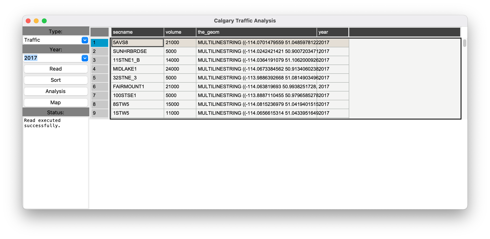

# Calgary-Traffic-App

## Introduction

This is one of my first projects created as a part of my Masters degree. The goal of this project was to learn the following:
- Make a GUI in Python to display data
- Use MongoDB to store data
- Use Jupyter Notebook to analyze data

To accomplish this I used Traffic and Incident data available from the City of Calgary and divided the project into 2 phases, an App and a Notebook. The App phase involved reading the data provided by the city and uploading it to a MongoDB cluster followed by displaying, sorting, analyzing, and mapping this data in the app. The Notebook phase involved analysis of the Traffic and Incident data as well as weather and road conditions to look for patterns.

## Requirements
Python Packages:
- pymongo
- tk-tools
- pandas
- folium
- pandastable
- matplotlib
- seaborn
- csv
- numpy
- math
- json

## Phase 1 - App

### How to Use

#### Startup

To run the app, simply execute the project_main.py file. This will start the reading of the data and uploading it to MongoDB. After the data is loaded the app will start and will display the following:

The user may now select which type of data they'd like to see and the year, and then click on one of the below functions.

#### Read

Clicking 'Read' will display the data as gathered from the city in cells:

#### Sort

Clicking 'Sort' will display data as gathered from the city in cells, sorted by most traffic volume or by most incidents at the location, based on the data type selected:

#### Analysis

Clicking analysis will display a chart showing the levels of traffic or incidents at the highest volume/incident location over the three years of data gathered:

#### Map

Clicking map will create a map.html file within the Phase 1 - App folder, which can be opened to display the location with the highest traffic volume or number of  incidents on a map of Calgary:

